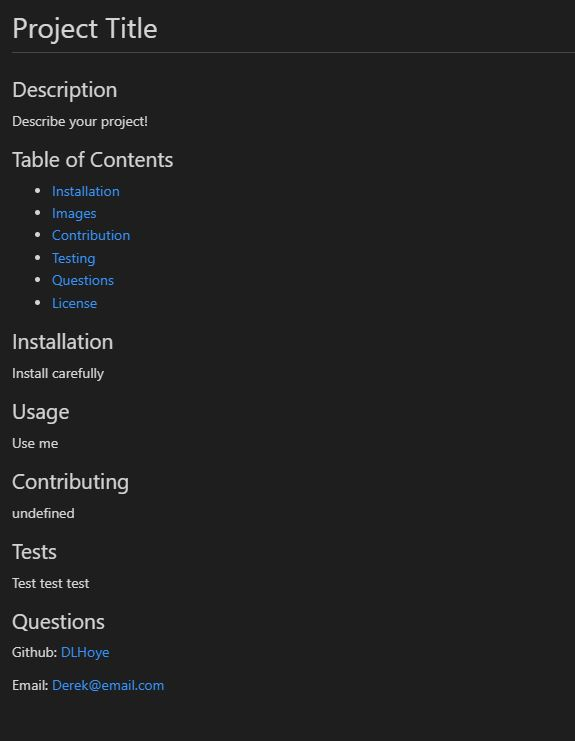

# 09-Node.js-Challenge-Professional-README-Generator

## Description

Generage a Profession README file for your project!

## Table of Contents

- [Installation](#installation)
- [Usage](#usage)
- [Video](#video)
- [Images](#images)
- [Questions](#questions)

## Installation

Type "npm i" into Terminal

## Usage

Type "node index.js" and answer the questions.

## Video

[Example Video](https://drive.google.com/file/d/1GJxIwJV2KcArFWJ2-ddl1mQSNlOdZ6VR/view "Example Video")

## Images

## 

## Questions

[My GitHub Profile](https://github.com/DLHoye)

For questions about my project, please contact me at [dhoye144@gmail.com](mailto:dhoye144@gmail.com).
